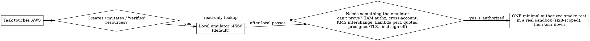

# AWS Local Emulation

## Overview

Dev and test work that touches AWS should run against a **local emulator on `http://localhost:4566`**, not the client's real cloud account. The emulator answers standard AWS SDK / CLI / IaC traffic with dummy credentials, so iterating costs **$0** and leaves **no footprint** — no billed resources, no lingering IAM roles or event-source mappings, no CloudTrail entries in the client's account.

**Core rule: for any task that creates, mutates, or "verifies" AWS resources, stand it up locally FIRST.** The client's real account is off-limits absent explicit per-session authorization — the same posture as this workspace's "production is off-limits without an explicit rule" safety rule. Reserve real AWS for a single, minimal, authorized, guaranteed-torn-down smoke test covering only what an emulator provably cannot validate.

**Violating the letter of this rule is violating its spirit.** A successful `aws sts get-caller-identity` is not a green light — it tells you credentials resolve, not that you are cleared to create resources in that account.

## When to emulate vs. hit real AWS



**Emulate (the default) when:** the task says "build / get X working," "test … end to end," or "verify the pipeline"; it will run `create-*` / `put-*` / `s3 mb` / `deploy`; you are iterating on boto3 pipelines, Lambda handlers, DynamoDB-stream triggers, S3→SQS/SNS wiring, or Terraform/CDK plans; you are writing CI tests; or the ambient credentials point at a client or billed account with no per-session write authorization.

**Use real AWS (sparingly, only when authorized) only for what the emulator cannot prove:** IAM / authorization correctness, credential / SigV4 / refresh paths, cross-account or cross-region behavior, KMS ciphertext interchange, Lambda performance / concurrency / timeout, quotas / throttling, presigned-URL / TLS behavior, and final pre-ship sign-off. Do it through the scoped `six8-scoped` profile (see [`~/.claude/README.md`](../../README.md)) as one minimal test with guaranteed teardown.

## Quick start (Floci — the default)

```bash
floci start                  # needs Docker; install: brew install floci-io/floci/floci
eval "$(floci env)"          # exports AWS_ENDPOINT_URL=…:4566 + dummy creds + region
aws s3 mb s3://scratch       # now aws / boto3 / terraform hit the emulator, not AWS
floci stop                   # 'floci stop --remove' also deletes the container
```

MiniStack is the Python-first / Docker-free alternative: `pip install ministack && ministack`. Full per-tool detail in [references/floci.md](references/floci.md) and [references/ministack.md](references/ministack.md).

## The drop-in contract (identical for both tools)

Point any AWS tool at the one endpoint with throwaway credentials:

```bash
export AWS_ENDPOINT_URL=http://localhost:4566
export AWS_DEFAULT_REGION=us-east-1
export AWS_ACCESS_KEY_ID=test        # any non-empty value; a 12-digit value becomes the account ID
export AWS_SECRET_ACCESS_KEY=test
```

```python
import boto3
s3 = boto3.client("s3", endpoint_url="http://localhost:4566",
                  region_name="us-east-1",
                  aws_access_key_id="test", aws_secret_access_key="test")
# reuse the same endpoint_url for every service; force path-style for S3
```

- **Inject the endpoint via env / config — never hardcode `:4566` in application code.**
- **S3 needs path-style** (`forcePathStyle=true`, or `--endpoint-url` on the CLI); virtual-host `bucket.localhost` DNS does not resolve, and presigned URLs 403 otherwise.
- **Reset between tests:** Floci `POST /_floci/state/reset`; MiniStack `POST /_ministack/reset` (add `?init=1` to wipe-and-reseed). Both also serve `/health`.

## Which emulator

| | Floci (default) | MiniStack (alternative) |
|---|---|---|
| Stack | Java native image / Docker | Python 3.12 (`pip install`) |
| Reach for it when | broad coverage, CI speed, Testcontainers, real Docker DB fidelity | Docker-free / pip-only, or you want its built-in SQS/SES message-inspection endpoints to assert on a pipeline |
| Start | `floci start` | `ministack` or `docker run -p 4566:4566 ministackorg/ministack` |
| Reset | `POST /_floci/state/reset` | `POST /_ministack/reset?init=1` |

Both are MIT, free forever, on `:4566`. Vendor headline numbers (service counts, startup times, image sizes) are self-reported — treat them as marketing and verify per-operation coverage before you depend on a specific service. Verified facts, caveats, and sources are in [references/](references/).

## What local emulation CANNOT prove — never ship on a local pass alone

- **IAM is not enforced.** Every call is authorized regardless of policies, roles, trust, boundaries, or SCPs. **A green local run is not proof of authorization** — a missing grant surfaces only as `AccessDenied` in real AWS. This is the number-one trap.
- **Credentials / SigV4 are not validated** — expired sessions, wrong keys, and clock skew never raise the real errors.
- **Account IDs and ARNs are fake** (`000000000000`). Resolve the account at runtime from STS; never hardcode it or parse it out of an ARN.
- **Coverage is uneven; some services are stubs** (Floci: Bedrock / Textract / Transcribe; MiniStack: EC2 has no real VMs, EMR / Amazon MQ / Backup are control-plane, SES stores-but-never-sends). An HTTP 200 does not mean the side effect happened.
- **State is ephemeral**, there is no cost / quota / throttling, and timing and consistency are unrealistic.
- **"Real" Docker-backed services (RDS / ElastiCache / ECS)** work only with the Docker socket mounted.

Full list with mitigations: [references/gotchas.md](references/gotchas.md).

## Red flags — you are about to burn the client's account

- Running `aws create-*` / `put-*` / `s3 mb` / `deploy` before an emulator is up.
- Treating a successful `aws sts get-caller-identity` as permission to create resources.
- Reading "verify" or "test end to end" as "do it against real AWS."
- Having no teardown plan for resources you are about to create.
- "It's just a small test, it'll cost cents" — the exposure is the client-account footprint and the missing authorization, not the dollar figure.

**All of these mean: stop, start the emulator, and point tooling at `:4566`.**

## Rationalization table

| Excuse | Reality |
|---|---|
| "`get-caller-identity` worked, so I can create resources." | It proves credentials resolve, not that you are authorized to mutate that account. Ask which account; emulate first. |
| "The MCP / CLI is right there, pointed at real AWS." | Path of least resistance ≠ correct. Repoint at `:4566`. |
| "'Verified' means verified against real AWS." | Verify wiring and logic locally first; real AWS is only for what the emulator can't prove. |
| "It's a tiny test — cost is cents." | The risk is footprint and governance in a client account, not the bill. |
| "Standing up an emulator is slower than just running it." | `floci start` takes seconds; an orphaned event-source mapping and an unauthorized production change do not clean themselves up. |

## Common mistakes

- Hardcoding `http://localhost:4566` in application code instead of injecting it via env / config.
- Forgetting S3 path-style → presigned-URL 403s and bucket-DNS failures.
- Assuming persistence — state is wiped on restart; seed fixtures via init hooks / IaC.
- Trusting a stub service's `200` as proof of the side effect.
- Shipping on a local pass without the one authorized real-AWS smoke test for IAM / perf / consistency.

---

Related: [`~/.claude/README.md`](../../README.md) — the real-AWS profiles `six8` (admin) and `six8-scoped` (PowerUser, what the AWS MCP uses), and the `aws-api-mcp-server` / `aws-documentation-mcp-server` MCP servers.
